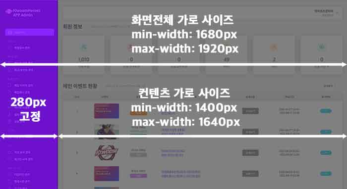
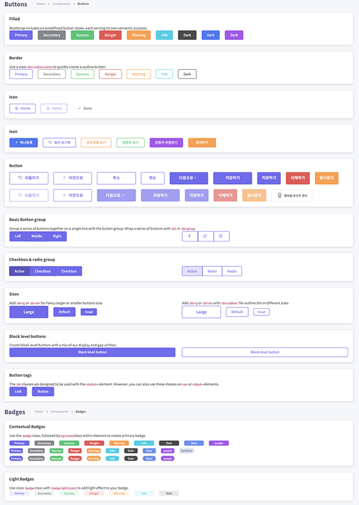

# KIWOOM Admin( 공통컴포넌트만 업로드함 )  
- 기한 ( 2021.9.14 ~ 2022.3.31 )
------------------
## 프로젝트 구성 

### SPA( single page application ) 방식 채용 
> 서버로부터 완전한 새로운 페이지를 불러오지 않고 현재의 페이지를 동적으로 다시 렌더링하는 방식

### SPA 에 사용된 프레임워크 
>Vue.js (프론트엔트 프레임웍)  

### 공통 컴포넌트 라이브러리 
>Bootstrap 

### 사용된 언어
>Typescript( 자바스크립트 슈퍼셋 ) / HTML5 / SCSS ( CSS 전처리기 )


### 화면 기본 사항
>화면 전체 가로 사이즈 : min-width: 1680px / max-width: 1920px

>sidebar( 좌측 메뉴 가로 사이즈 ) 280px 고정

>contents( 가운데 컨텐츠 가로 사이즈 )<br/>
  min-width: 1400px / max-width: 1640px



### 화면 공통 컴포넌트 구성<br>
( 버튼 / 라벨 / 테이블 / 카드뷰 /페이지네이션 / 네비 / 폼 등)
> [화면 구성 요소 바로가기](markup/form-layout.html)

[](markup/form-layout.html)

-------------

## 초기 세팅

###  - 프로젝트 셋업 
```
npm install
```

### - 컴파일 및 핫리로딩 ( 개발 버전 )
```
npm run serve
```

### - 컴파일 및 소스 압축/ 개발 모드 
```
npm run build
```

### - 컴파일 및 소스 압축/ 프로덕션( 배포 ) 모드 
```
npm run prod
```


-------------

## 문서 정의
| Document Type      | `<!DOCTYPE html>` ( html5 로 지정 ) |
| :---------------------| :-------------------                          |
| Incoding               | `<meta charset="utf-8" />`            |
| Cross Browsing      |Chrome  | 

> note :
> - html5로 작업
> - css class 이름은 알파벳(대소문자)로 시작하되 숫자/특수문자로 시작하여선 안된다.
> - css id 는 Camel case 방식으로 이름을 명기한다.

----------

##  Directory

### - 전체 구조
| Directory            |  Description |
|:--------------------|:------------- |
| dist/   | 배포 버전 파일 모음   |
| markup/   |  웹퍼블리싱 파일 모음   |
| public/   |  정적 페이지 / 리소스 모음   |
| src   |  vuejs 원본 소스 ( 개발 버전 로컬 파일 )   |
| vue.config.js   | vue 설정 파일  |
| babel.config.js   | babel 설정 파일  |
| tsconfig.json   | typescript 설정 파일  |
| package.json   | 프로젝트 패키지 버전 및 설치 설정 안내 파일  |


### - 웹퍼블리싱 파일 구조
| Directory            |  Description |
|:--------------------|:------------- |
| markup/   | 웹퍼블리싱 파일 모음( .html 확장자를 가진 파일  )    |
| markup/assets/css   |   css 파일   |
| markup/assets/fonts   |   폰트 파일   |
| markup/assets/images   |   이미지 리소스    |
| markup/assets/scss   |   scss 모음( css 로 컴파일 되기 전 상태 )   |

### - SCSS( CSS 전처리기 ) 구조
>note :
> - font는 **Noto Sans KR**
> - 폰트 정의는 **font.scss** 상단에 정의 되어 있다.

| Directory                                     | File Name                                          | Description               |
| :--------------------------------------- | :-------------------------------------------- | :----------------------- |
| markup/assets/scss/bootstrap-extended  | 부트스트랩 확장 파일들(다수의 파일명 생략)	     |  부트스트랩 확장형 scss |
| markup/assets/scss/components            | 부트스트랩 확장 파일들(다수의 파일명 생략)	     | 부트스트랩 컴포넌트 확장형 scss |
| markup/assets/scss/common                 | _badge.scss                                       | 뱃지 scss  | 
| markup/assets/scss/common                 | _breadcrumb.scss                               | 브래드크럼 scss  |
| markup/assets/scss/common                 | _button.scss                                       | 버튼 scss | 
| markup/assets/scss/common                 | _dropdown.scss                                  | 드롭다운 scss  | 
| markup/assets/scss/common                 | _form.scss                                         | 폼 scss | 
| markup/assets/scss/common                 | _header.scss                                      | 헤더 scss  | 
| markup/assets/scss/common                 | _layout.scss                                       | 레이아웃 scss  | 
| markup/assets/scss/common                 | _mixin.scss                                        | 믹스인 scss  | 
| markup/assets/scss/common                 | _navigation.scss                                  | 메뉴 scss  | 
| markup/assets/scss/common                 | _picker.scss                                        | date / time picker scss   | 
| markup/assets/scss/common                 | _popup.scss                                        | 레이어팝업 scss  | 
| markup/assets/scss/common                 | _reset.scss                                          |  초기화 scss  | 
| markup/assets/scss/common                 | _sidebar.scss                                       |  사이드 메뉴 scss  | 
| markup/assets/scss/common                 | _table.scss                                          |  테이블 scss  | 
| markup/assets/scss/common                 | _tooltip.scss                                        |  툴팁 scss | 
| markup/assets/scss/common                 | _transition.scss                                    |  모션 scss  | 
| markup/assets/scss/                             | _bootstrap-extended.scss                      |  부트스트랩확장파일 모음 scss  | 
| markup/assets/scss/                             | _common.scss                                     |  컴포넌트 모음 scss  | 
| markup/assets/scss/                             | _customizeBootstrap.scss                       | 부트스트랩 커스텀 scss  | 
| markup/assets/scss/                             | _dashboard.scss                                   |  대시보드 관리 scss  | 
| markup/assets/scss/                             | _banner.scss                                       |  배너 관리 scss  | 
| markup/assets/scss/                             | _event.scss                                          | 이벤트 관리 scss  | 
| markup/assets/scss/                             | _login.scss                                           |  로그인 관리 scss  | 
| markup/assets/scss/                             | _font.scss                                            |  폰트 관리 scss  | 
| markup/assets/scss/                             | all.scss                                               |  모든 scss 파일 취합   | 

#### 웹 퍼블리싱 실행 
- 아래 명령어를 터미널에 치고 나면 scss 가 컴파일 된다. 그리고 나서 markup 폴더안에 있는 html 파일을 클릭 실행.

```
gulp dev
```

----------------

### - Vue 배포용( production ) 폴더 구성 
| Directory              | Description             |
| :---------------------|:-----------------------|
| dist/fonts/             | 폰트 리소스 경로          |
| dist/img                | 이미지 리소스 경로        |
| dist/js                   | 자바스크립트 리소스 경로  |
| dist/favicon.ico       | 파비콘  |
| dist/index.html       | entry 페이지  |


### - Vue 프론트엔드 전체 파일 구조 ( 원본 local/development 모드 기준 )
| Directory            |  Description |
|:--------------------|:------------- |
|public/                | 정적 페이지, 리소스 등을 포함하는 경로 |
|public/index.html  | 초기 진입 실행 파일( 실제 모든 화면이 표시될 페이지 )  |
|public/favicon.ico | 브라우저 탭에 표시될 파비콘  |
| src/assets/fonts/   |   폰트 리소스 경로  |
| src/assets/images/common/   |   공통 이미지 리소스 경로  |
| src/assets/images/pages/   |   페이지별 이미지 리소스 경로  |
| src/assets/images/scss/   |   scss 파일 경로  |
| src/components/   |  vue 공통 컴포넌트 경로  |
| src/core/          | 프로젝트 인증/인가/필터/권한 Data 관련  |
| src/filters/        | 프로젝트 필터  |
| src/mixin/        | 범용성 컴포넌트 정의  |
| src/model/        | api 데이터 타입 구성을 위한 인터페이스  |
| src/pages/        | 화면 entry point  |
| src/restApi/      | ajax 통신의 위한 service 클래스 모음  |
| src/router/      |  화면 라우터   |
| src/service/      | 전역 서비스 클래스  |
| src/store/      | vue store ( 상태관리저장소 )  |
| src/types/      | vue 초기 실행시 type 추가 항목 정의  |
| src/utils/        | 유틸 static 클래스 모음  |
| src/views/      | 각 화면을 이루고 있는 컴포넌트 클래스  |
| src/shims-html.d.ts    |  *.html 로 ts 파일에 로드 할 수 있게 초기 설정   |
| src/shims-vue.d.ts     |  ts 내부에 Vue 를 인식시켜주는 역활  |


----------------

### - 프로젝트에 사용된 라이브러리 ( package.json 참조 )
| npm 으로 설치된 라이브러리 이름           |  버전      |     Description                |
| :---------------------------------------|:---------|:---------------------------- |
| vue                                           | 2.6.11 | 화면 전체를 구성하는 spa( single page application ) 프레임워크 |
| vue-router                                  | 3.2.0  | vue 화면 경로 구성 라이브러리 |
| vuex                                          | 3.4.0  | vue 에서 데이터 상태 관리 라이브러리 |
| vuex-class                                  |  0.3.2 | vuex 상태 모듈 네이밍 바이딩  |
| vuex-module-decorators               |  1.0.1 | vue 의 내부의  typescript 와 html 분리 해주는 모듈 |
| vue-class-component                    | 7.2.3 | vue component 기본 클래스  |
| vue-property-decorator                 | 9.1.2| vue component 와 typescript 간에 원활한 연결 도움 모듈 |
| vee-validate                                | 3.4.5  | vue form validate 체크 라이브러리  |
| bootstrap                                    | 5.1.3 | 부트스트랩 ( 컴포넌트 스타일 프레임워크 ) |
| popperjs                                     | 2.11.0 | 부트스트랩 의존성 파일  |
| dayjs                                         | 1.10.7  | 날짜 포맷 라이브러리     |
| flatpickr                                     | 4.6.9  | 달력 picker 라이브러리     |
| axios                                         | 0.21.1 | api 통신 ajax 라이브러리  |
| babel-polyfill                               | 6.26.0  | 바벨 트랜스파일링 폴리필   |
| es6-promise                                | 4.2.8  | es6 promise 폴리필  |
| tinymce-vue                                | 3.2.8  | vue rich text editor   |

> note : 위 라이브러리는 모두 MIT 

---------
## 설정 파일 

###  tsconfig.json( typescript 설정 파일) 설정 파일 속성

**files**
-컴파일할 파일들을 지정하는 옵션
```
{
"files": ["app.ts", "./practice/test.ts"]
}
```

**include**

- files와 달리 컴파일할 파일을 지정하는 것이 아닌 디렉토리를 지정
- 타입스크립트는 기본적으로 node_modules를 제외하지만 써드 파티 라이브러리의 타입을 정의해놓는 @types 디렉토리는 컴파일에 포함함
- 와일드 카드 패턴
* 		*: 해당 디렉토리의 모든 파일을 검색
* 		**: 하위 디렉토리를 재귀적으로 접근
* 		?: 해당 디렉토리안에 파일의 이름 중 키워드를 포함하는 파일 검색

```
{
"include": ["src/**/*"]
}
```

**exclude**

- include와 반대로 컴파일 제외할 디렉토리를 지정

```
{
"exclude": ["node_modules"]
}
```

**extends**

- 특정 타입스크립트 설정 파일에서 다른 타입스크립트 설정을 가져와 추가할 수 있는 옵션
- 오버라이드 가능

```
// config/bash.json
{
"compilerOptions": {
 "noImplicitAny": true
}
}

// tsconfig.json
{
"extends": "./config/base.json"
}
```

**target**

- 타입스크립트 파일을 컴파일 했을 때 빌드 디렉토리에 생성되는 자바스크립트의 버전 명시
```
{
"target": "esnext"
}
```

**lib**

- 타입스크립트 파일을 자바스크립트 파일로 컴파일 할 때 포함될 라이브러리 목록
- 대표적으로 Promise객체, dom관련 속성을 인식할 수 있는 esnext, dom, dom.iterable 사용
```
{
"lib": ["es2015", "dom", "dom.iterable"]
}
```
**allowJs**
- 타입스크립트 컴파일 작업을 진행할 때 자바스크립트 파일의 포함 여부를 설정하는 옵션

-----------


### - HTML5 History Mode 에서 Nginx 설정법
- https://router.vuejs.org/guide/essentials/history-mode.html#example-server-configurations

**nginx**
```
location / {
try_files $uri $uri/ /index.html;
}
```


### .vue 파일에서 html과 ts 분리하는 법 ( 위에서 npm install 로 한번에 설정 가능- 아래는 추가 이해를 위한 설명 )
#### 1. vue-template-loader 설치

`npm install --save-dev vue-template-loader`

#### 2. vue.config.js 에 아래 코드 추가 ( configureWebpack 의 내용 추가 )

```
//vue.config.js
module.exports={
    configureWebpack:{
         module:{
         rules:[
                {
                    test:/.html$/,
                    loader:"vue-template-loader",
                    exclude:/index.html/
                },
             ]
         }
    }
}
```

#### 3. src 폴더에 `shims-html.d.ts` 파일 추가 그리고 아래 코드 입력

```
declare module '*.html'{
import Vue,{ ComponentOptions, FunctionalComponentOptions} from 'vue';
interface WithRender{
 <V extends Vue, U extends ComponentOptions<V> | FunctionalComponentOptions>(options: U, ): U;
 <V extends typeof Vue>(component: V): V;
}
const withRender: WithRender;
export default withRender;
}
```

#### 실행 예시

```
import WithRender from './App.html';
@WithRender
@Component
export default class App extends Vue { }
```
-----------


## TASK list
| 카테고리 | id| 화면명 | 경로 | 비고 | 진행사항 |
|:---|:----|:----|:----|:----|:----|
|공통 컴포넌트 |---|---|[markup/form-layout.html](markup/form-layout.html)|---|100%|
|로그인| CL.1|---|[markup/CL.1.html](markup/CL.1.html)|---|100%|
|비밀번호 변경| GNB.1.1|비밀번호 변경.p|[markup/GNB.1.1.html](markup/GNB.1.1.html)|---|100%|
|시즌일정불러오기| GNB.1.2|시즌일정불러오기.p|[markup/GNB.1.2.html](markup/GNB.1.2.html)|---|100%|
|로그아웃| GNB.1.3|로그아웃|로그아웃|---|100%|
|404에러| GNB.1.4|404에러|[markup/GNB.1.4.html](markup/GNB.1.4.html)|---|100%|
|Sidebar| Sidebar|사이드바 메뉴|사이드바 메뉴|---|100%|
|Dashboard| Dashboard |대시보드|[markup/DS.html](markup/Dashboard.html)|---|100%|
|회원관리| M.1 |회원관리_회원정보 관리_회원목록|[markup/M.1.html](markup/M.1.html)|---|100%|
|회원관리| M.1.1|회원관리_회원정보 관리_회원상세_활동.p|[markup/M.1.1.html](markup/M.1.1.html)|---|100%|
|회원관리| M.1.2|~~회원관리_회원정보 관리_회원상세_휴면.p~~|---삭제---|---|-%|
|회원관리| M.1.1.2|회원관리_회원정보 관리_회원상세_탈퇴.p|[markup/M.1.1.2.html](markup/M.1.1.2.html)|---|100%|
|회원관리| M.1.1.3|~~회원관리_회원정보 관리_회원상세_탈퇴.p~~|---삭제---|---|-%|
|회원관리| M.1.1.4|~~회원관리_회원정보 관리_회원상세_회원탈퇴사유.p~~|---삭제---|---|-%|
|회원관리| M.1.1.5|~~회원관리_회원정보 관리_회원상세_탈퇴회원삭제.p~~|---삭제---|---|-%|
|멤버쉽관리| MB.1|멤버쉽/포인트 관리_멤버쉽관리|[markup/MB.1.html](markup/MB.1.html)|---|100%|
|멤버쉽관리| MB.1.1|멤버쉽/포인트 관리_멤버쉽관리_멤버쉽 상세|[markup/MB.1.1.html](markup/MB.1.1.html)|---|100%|
|멤버쉽관리| MB.1.2|멤버쉽/포인트 관리_멤버쉽관리_포인트 상세|[markup/MB.1.2.html](markup/MB.1.2.html)|---|100%|
|멤버쉽관리| MB.1.3|멤버쉽/포인트 관리_멤버쉽관리_포인트/등급 가이드 상세|[markup/MB.1.3.html](markup/MB.1.3.html)|---|100%|
|멤버쉽관리| MB.2|멤버쉽관리_멤버쉽 혜택관리|[markup/MB.2.html](markup/MB.2.html)|---|100%|
|멤버쉽관리| MB.2.1|멤버쉽관리_멤버쉽 혜택관리_멤버쉽혜택 상세|[markup/MB.2.1.html](markup/MB.2.1.html)|---|100%|
|배너관리| B.1 |배너관리_메인배너관리|[markup/B.1.html](markup/B.1.html)|---|100%|
|배너관리| B.1_a |배너관리_메인배너관리_nodata|[markup/B.1_a.html](markup/B.1_a.html)|---|100%|
|배너관리| B.1_1|~~배너관리_메인배너관리_배너미리보기~~|---삭제---|---|-%|
|배너관리| B.1_2|~~배너관리_메인배너관리_공지사항상세 미리보기~~|---삭제---|---|-%|
|배너관리| B.2_1_a|배너관리_메인배너관리_배너등록_1)일반이벤트_입력전|[markup/B.2_1_a.html](markup/B.2_1_a.html)|---|100%|
|배너관리| B.2_1.1|배너관리_메인배너관리_배너등록_1)일반이벤트_이벤트불러오기.p|[markup/B.2_1.1.html](markup/B.2_1.1.html)|---|100%|
|배너관리| B.2_1.2|배너관리_메인배너관리_배너등록_1)일반이벤트_이벤트불러오기_(nodata).p|[markup/B.2_1.2.html](markup/B.2_1.2.html)|---|100%|
|배너관리| B.2_1_b|배너관리_메인배너관리_배너등록_1)일반이벤트_입력후|[markup/B.2_1_b.html](markup/B.2_1_b.html)|---|100%|
|배너관리| B.2_1.3|~~배너관리_메인배너관리_배너등록_1)일반이벤트_이벤트상세 미리보기.p~~|---삭제---|---|-%|
|배너관리| B.2_2_a|배너관리_메인배너관리_배너등록_2)공지사항_입력전|[markup/B.2_2_a.html](markup/B.2_2_a.html)|---|100%|
|배너관리| B.2_2_b|배너관리_메인배너관리_배너등록_2)공지사항_입력중|---상동---| B.2_2_a 로 통일 |--|
|배너관리| B.2_2_c|배너관리_메인배너관리_배너등록_2)공지사항_입력후|---상동---| B.2_2_a 로 통일 |--|
|배너관리| B.2_2.1|~~배너관리_메인배너관리_배너등록_2)공지사항_공지사항상세 미리보기.p~~|---삭제---|---|-%|
|배너관리| B.2_3_a|배너관리_메인배너관리_배너등록_3)외부링크_입력전|[markup/B.2_3_b.html](markup/B.2_3_b.html)|---|100%|
|배너관리| B.2_3_b|배너관리_메인배너관리_배너등록_3)외부링크_입력후|--상동---| B.2_3_b 로 통일 |--|
|배너관리| B.3_1|배너관리_메인배너관리_배너상세_1)라이브이벤트|[markup/B.3_1.html](markup/B.3_1.html)|---|100%|
|배너관리| B.3_1.1_a|~~배너관리_메인배너관리_배너상세_1)라이브이벤트_이벤트상세팝업(상품형/참여형_진행중).p~~|---삭제---|---|-%|
|배너관리| B.3_1.1_b|~~배너관리_메인배너관리_배너상세_2)라이브이벤트_이벤트상세팝업(상품형/참여형_진행예정).p~~|---삭제---|---|-%|
|배너관리| B.3_2|배너관리_메인배너관리_배너상세_2)일반이벤트|[markup/B.3_2.html](markup/B.3_2.html)|---|100%|
|배너관리| B.3_2.1_a|~~배너관리_메인배너관리_배너상세_2)일반이벤트_이벤트상세팝업(상품형/참여형_진행중).p~~|---삭제---|---|-%|
|배너관리| B.3_2.1_b|~~배너관리_메인배너관리_배너상세_2)일반이벤트_이벤트상세팝업(상품형/참여형_마감일:추첨 전).p~~|---삭제---|---|-%|
|배너관리| B.3_2.1_c|~~배너관리_메인배너관리_배너상세_2)일반이벤트_이벤트상세팝업(상품형/참여형_진행예정).p~~|---삭제---|---|-%|
|배너관리| B.3_2.2_a|~~배너관리_메인배너관리_배너상세_2)일반이벤트_이벤트상세팝업(포인트형_진행중).p~~|---삭제---|---|-%|
|배너관리| B.3_2.2_b|~~배너관리_메인배너관리_배너상세_2)일반이벤트_이벤트상세팝업(포인트형_마감일:추첨 전).p~~|---삭제---|---|-%|
|배너관리| B.3_2.2_c|~~배너관리_메인배너관리_배너상세_2)일반이벤트_이벤트상세팝업(포인트형_진행예정).p~~|---삭제---|---|-%|
|배너관리| B.3_3|배너관리_메인배너관리_배너상세_3)공지사항|[markup/B.3_3.html](markup/B.3_3.html)|---|100%|
|배너관리| B.3_3.1|~~배너관리_메인배너관리_배너상세_3)공지사항_공지사항상세팝업.p~~|---삭제---|---|-%|
|배너관리| B.3_4|배너관리_메인배너관리_배너상세_4)외부링크|[markup/B.3_4.html](markup/B.3_4.html)|---|100%|
|배너관리| B_CP|배너관리_배너관리_공통팝업|[markup/B_CP.html](markup/B_CP.html)|---|100%|
|이벤트관리| EL.1|이벤트관리_라이브이벤트|[markup/EL.1.html](markup/EL.1.html)|---|100%|
|이벤트관리| EL.2_1_a|이벤트관리_라이브이벤트_라이브이벤트 등록_1)상품형_입력 전|[markup/EL.2_1_a.html](markup/EL.2_1_a.html)|---|100%|
|이벤트관리| EL.2_1_b|이벤트관리_라이브이벤트_라이브이벤트 등록_1)상품형_입력 후|[markup/EL.2_1_b.html](markup/EL.2_1_b.html)|---|100%|
|이벤트관리| EL.2_2_a|이벤트관리_라이브이벤트_라이브이벤트 등록_2)포인트형_입력 전|[markup/EL.2_2_a.html](markup/EL.2_2_a.html)|---|100%|
|이벤트관리| EL.2_2_b|이벤트관리_라이브이벤트_라이브이벤트 등록_2)포인트형_입력 후|[markup/EL.2_2_b.html](markup/EL.2_2_b.html)|---|100%|
|이벤트관리| EL.2_3_a|이벤트관리_라이브이벤트_라이브이벤트 등록_3)참여형_입력 전|[markup/EL.2_3_a.html](markup/EL.2_3_a.html)|---|100%|
|이벤트관리| EL.2_3_b|이벤트관리_라이브이벤트_라이브이벤트 등록_3)참여형_입력 후|[markup/EL.2_3_b.html](markup/EL.2_3_b.html)|---|100%|
|이벤트관리| EL.3_1_a|이벤트관리_라이브이벤트_라이브이벤트 상세_1)상품형(진행예정)|[markup/EL.3_1_a.html](markup/EL.3_1_a.html)|---|100%|
|이벤트관리| EL.3_1_b|이벤트관리_라이브이벤트_라이브이벤트 상세_1)상품형(진행중)|[markup/EL.3_1_b.html](markup/EL.3_1_b.html)|---|100%|
|이벤트관리| EL.3_1_c|이벤트관리_라이브이벤트_라이브이벤트 상세_1)상품형(마감)|[markup/EL.3_1_c.html](markup/EL.3_1_c.html)|---|100%|
|이벤트관리| EL.3_1_d|이벤트관리_라이브이벤트_라이브이벤트 상세_1)상품형(추첨완료)|[markup/EL.3_1_d.html](markup/EL.3_1_d.html)|---|100%|
|이벤트관리| EL.3_1_e|이벤트관리_라이브이벤트_라이브이벤트 상세_1)상품형(종료)|[markup/EL.3_1_e.html](markup/EL.3_1_e.html)|---|100%|
|이벤트관리| EL.4.1 |이벤트관리_라이브이벤트_1)상품형(선착순)_응모현황보기.p|[markup/EL.4.1.html](markup/EL.4.1.html)|---|100%|
|이벤트관리| EL.4.1_a|이벤트관리_라이브이벤트_1))상품형(선착순)_응모현황보기_nodata.p|[markup/EL.4.1_a.html](markup/EL.4.1_a.html)|---|100%|
|이벤트관리| EL.4.1_b|이벤트관리_라이브이벤트_1)상품형(선착순)_응모현황보기_Filter.p|[markup/EL.4.1_b.html](markup/EL.4.1_b.html)|---|100%|
|이벤트관리| EL.4.2_a|이벤트관리_라이브이벤트_2)상품형(선착순+랜덤)_응모현황보기.p|[markup/EL.4.2_a.html](markup/EL.4.2_a.html)|---|100%|
|이벤트관리| EL.4.2_b|이벤트관리_라이브이벤트_2)상품형(선착순+랜덤)_추첨하기.p|[markup/EL.4.2_b.html](markup/EL.4.2_b.html)|---|100%|
|이벤트관리| EL.4.3 |이벤트관리_라이브이벤트_3)포인트형_응모현황보기.p|[markup/EL.4.3.html](markup/EL.4.3.html)|---|100%|
|이벤트관리| EL.4.4_a|이벤트관리_라이브이벤트_4)수동_응모현황보기.p|[markup/EL.4.4_a.html](markup/EL.4.4_a.html)|---|100%|
|이벤트관리| EL.4.4_b|~~이벤트관리_라이브이벤트_4)수동_추첨하기.p~~|---삭제---|---|-%|
|이벤트관리| EL.5|이벤트관리_라이브이벤트_당첨자보기|[markup/EL.5.html](markup/EL.5.html)|---|100%|
|이벤트관리| EG.1|이벤트관리_일반이벤트|[markup/EG.1.html](markup/EG.1.html)|---|100%|
|이벤트관리| EG.1_a|이벤트관리_일반이벤트_nodata|[markup/EG.1_a.html](markup/EG.1_a.html)|---|100%|
|이벤트관리| EG.2_1_a|이벤트관리_일반이벤트_일반이벤트 등록_1)상품형_입력 전| EG.2.1_b 로 통일|---|--|
|이벤트관리| EG.2_1_b|이벤트관리_일반이벤트_일반이벤트 등록_1)상품형_입력 후|[markup/EG.2_1_b.html](markup/EG.2_1_b.html)|---|100%|
|이벤트관리| EG.2_2_a|이벤트관리_일반이벤트_일반이벤트 등록_2)포인트형_입력 전|EG.2_2_b 로 통일|---|--|
|이벤트관리| EG.2_2_b|이벤트관리_일반이벤트_일반이벤트 등록_2)포인트형_입력 후|[markup/EG.2_2_b.html](markup/EG.2_2_b.html)|---|100%|
|이벤트관리| EG.2_3_a|이벤트관리_일반이벤트_일반이벤트 등록_3)참여형_입력 전|EG.2_3_b 로 통일|---|--|
|이벤트관리| EG.2_3_b|이벤트관리_일반이벤트_일반이벤트 등록_3)참여형_입력 후|[markup/EG.2_3_b.html](markup/EG.2_3_b.html)|---|100%|
|이벤트관리| EG.1.1 |~~이벤트관리_일반이벤트_일반이벤트 등록_경품불러오기.p~~|---삭제---|---|-%|
|이벤트관리| EG.1.1_a|~~이벤트관리_일반이벤트_일반이벤트 등록_경품불러오기_(nodata).p~~|---삭제---|---|-%|
|이벤트관리| EG.1.2 |~~이벤트관리_일반이벤트_일반이벤트 등록_미리보기.p~~|---삭제---|---|-%|
|이벤트관리| EG.3_1 |~~이벤트관리_일반이벤트_종료된이벤트 복사등록_1)상품형~~|---삭제---|---|-%|
|이벤트관리| EG.3_2 |~~이벤트관리_일반이벤트_종료된이벤트 복사등록_2)포인트형~~|---삭제---|---|-%|
|이벤트관리| EG.3_3 |~~이벤트관리_일반이벤트_종료된이벤트 복사등록_3)참여형~~|---삭제---|---|-%|
|이벤트관리| EG.4_1_a|이벤트관리_일반이벤트_일반이벤트 상세_1)상품형(진행중)|[markup/EG.4_1_a.html](markup/EG.4_1_a.html)|---|100%|
|이벤트관리| EG.4_1_b|이벤트관리_일반이벤트_일반이벤트 상세_1)상품형(마감일:추첨 전)|[markup/EG.4_1_b.html](markup/EG.4_1_b.html)|---|100%|
|이벤트관리| EG.4_1_c|이벤트관리_일반이벤트_일반이벤트 상세_1)상품형(마감:추첨 전)|[markup/EG.4_1_c.html](markup/EG.4_1_c.html)|---|100%|
|이벤트관리| EG.4_1_d|이벤트관리_일반이벤트_일반이벤트 상세_1)상품형(마감:추첨 후)|[markup/EG.4_1_d.html](markup/EG.4_1_d.html)|---|---|100%
|이벤트관리| EG.4_1_e|이벤트관리_일반이벤트_일반이벤트 상세_1)상품형(진행예정)|[markup/EG.4_1_e.html](markup/EG.4_1_e.html)|---|100%|
|이벤트관리| EG.4_1_f|~~이벤트관리_일반이벤트_일반이벤트 상세_1)상품형(일시중지)~~|---삭제---|---|-%|
|이벤트관리| EG.4_1_g|이벤트관리_일반이벤트_일반이벤트 상세_1)상품형(종료)|[markup/EG.4_1_g.html](markup/EG.4_1_g.html)|---|100%|
|이벤트관리| EG.4_1.1|이벤트관리_일반이벤트_일반이벤트 상세_1)상품형_경품상세.p|[markup/EG.4_1.1.html](markup/EG.4_1.1.html)|---|100%|
|이벤트관리| EG.4_2_a|이벤트관리_일반이벤트_일반이벤트 상세_2)포인트형(진행중)|[markup/EG.4_2_a.html](markup/EG.4_2_a.html)|---|100%|
|이벤트관리| EG.4_2_b|~~이벤트관리_일반이벤트_일반이벤트 상세_2)포인트형(마감일:추첨 전)~~|---삭제---|---|-%|
|이벤트관리| EG.4_2_c|~~이벤트관리_일반이벤트_일반이벤트 상세_2)포인트형(마감:추첨 전)~~|---삭제---|---|-%|
|이벤트관리| EG.4_2_d|~~이벤트관리_일반이벤트_일반이벤트 상세_2)포인트형(마감:추첨 후)~~|---삭제---|---|-%|
|이벤트관리| EG.4_2_e|~~이벤트관리_일반이벤트_일반이벤트 상세_2)포인트형(진행예정)~~|---삭제---|---|-%|
|이벤트관리| EG.4_2_f|~~이벤트관리_일반이벤트_일반이벤트 상세_2)포인트형(일시중지)~~|---삭제---|---|-%|
|이벤트관리| EG.4_2_g|~~이벤트관리_일반이벤트_일반이벤트 상세_2)포인트형(종료)~~|---삭제---|---|-%|
|이벤트관리| EG.4_3_a|~~이벤트관리_일반이벤트_일반이벤트 상세_3)참여형(진행중)~~|---삭제---|---|-%|
|이벤트관리| EG.4_3_b|~~이벤트관리_일반이벤트_일반이벤트 상세_3)참여형(마감일:추첨 전)~~|---삭제---|---|-%|
|이벤트관리| EG.4_3_c|~~이벤트관리_일반이벤트_일반이벤트 상세_3)참여형(마감:추첨 전)~~|---삭제---|---|-%|
|이벤트관리| EG.4_3_d|~~이벤트관리_일반이벤트_일반이벤트 상세_3)참여형(마감:추첨 후)~~|---삭제---|---|-%|
|이벤트관리| EG.4_3_e|~~이벤트관리_일반이벤트_일반이벤트 상세_3)참여형(진행예정)~~|---삭제---|---|-%|
|이벤트관리| EG.4_3_f|~~이벤트관리_일반이벤트_일반이벤트 상세_3)참여형(일시중지)~~|---삭제---|---|-%|
|이벤트관리| EG.4_3_g|~~이벤트관리_일반이벤트_일반이벤트 상세_3)참여형(종료)~~|---삭제---|---|-%|
|이벤트관리| EG.4_3.1|~~이벤트관리_일반이벤트_일반이벤트 상세_3)참여형_경품상세.p~~|---삭제---|---|-%|
|이벤트관리| EG.5.1 |이벤트관리_일반이벤트_상품형/참여형(진행중)_응모현황보기.p|[markup/EG.5.1.html](markup/EG.5.1.html)|---|100%|
|이벤트관리| EG.5.1_a|이벤트관리_일반이벤트_상품형/참여형(진행중)_응모현황보기_nodata.p|[markup/EG.5.1_a.html](markup/EG.5.1_a.html)|---|100%|
|이벤트관리| EG.5.2 |이벤트관리_일반이벤트_포인트형(진행중)_응모현황보기.p|[markup/EG.5.2.html](markup/EG.5.2.html)|---|100%|
|이벤트관리| EG.6_1_1 |~~이벤트관리_일반이벤트_일반이벤트 상세_추첨하기(상품형/참여형)_1)선착순-1.p~~|---삭제---|---|-%|
|이벤트관리| EG.6_1_1>2 |~~이벤트관리_일반이벤트_일반이벤트 상세_추첨하기(상품형/참여형)_1)선착순-2.p~~|---삭제---|---|-%|
|이벤트관리| EG.6_1_2 |~~이벤트관리_일반이벤트_일반이벤트 상세_추첨하기(상품형/참여형)_2)선착순+랜덤-1.p~~|---삭제---|---|-%|
|이벤트관리| EG.6_1_2>2 |~~이벤트관리_일반이벤트_일반이벤트 상세_추첨하기(상품형/참여형)_2)선착순+랜덤-2.p~~|---삭제---|---|-%|
|이벤트관리| EG.6_1_3 | ~~이벤트관리_일반이벤트_일반이벤트 상세_추첨하기(상품형/참여형)_3)랜덤-1.p~~|---삭제---|---|-%|
|이벤트관리| EG.6_1_3>2 | ~~이벤트관리_일반이벤트_일반이벤트 상세_추첨하기(상품형/참여형)_3)랜덤-2.p~~|---삭제---|---|-%|
|이벤트관리| EG.6_1_4>1 | 이벤트관리_일반이벤트_일반이벤트 상세_추첨하기(상품형/참여형)_4)수동-1.p|[markup/EG.6_1_4>1.html](markup/EG.6_1_4>1.html)|---|100%|
|이벤트관리| EG.6_1_4>2 | ~~이벤트관리_일반이벤트_일반이벤트 상세_추첨하기(상품형/참여형)_4)수동-2.p~~|---삭제---|---|-%|
|이벤트관리| EG.6_2_1 | ~~이벤트관리_일반이벤트_일반이벤트 상세_추첨하기(포인트형)_1)선착순-1.p~~|---삭제---|---|-%|
|이벤트관리| EG.6_2_1>2 | ~~이벤트관리_일반이벤트_일반이벤트 상세_추첨하기(포인트형)_1)선착순-2.p~~ |---삭제---|---|-%|
|이벤트관리| EG.6_2_2 | ~~이벤트관리_일반이벤트_일반이벤트 상세_추첨하기(포인트형)_2)선착순+랜덤-1.p~~ |---삭제---|---|-%|
|이벤트관리| EG.6_2_2>2 | ~~이벤트관리_일반이벤트_일반이벤트 상세_추첨하기(포인트형)_2)선착순+랜덤-2.p~~|---삭제---|---|-%|
|이벤트관리| EG.6_2_3 | ~~이벤트관리_일반이벤트_일반이벤트 상세_추첨하기(포인트형)_3)랜덤-1.p~~ |---삭제---|---|-%|
|이벤트관리| EG.6_2_3>2 | ~~이벤트관리_일반이벤트_일반이벤트 상세_추첨하기(포인트형)_3)랜덤-2.p~~|---삭제---|---|-%|
|이벤트관리| EG.6_2_4>1 | ~~이벤트관리_일반이벤트_일반이벤트 상세_추첨하기(포인트형)_4)수동-1.p~~ |---삭제---|---|-%|
|이벤트관리| EG.6_2_4>2 | ~~이벤트관리_일반이벤트_일반이벤트 상세_추첨하기(포인트형)_4)수동-2.p~~ |---삭제---|---|-%|
|이벤트관리| EG.7_1_1| 이벤트관리_일반이벤트_일반이벤트 상세(상품형/참여형)_당첨자보기(선착순).p|[markup/EG.7_1_1.html](markup/EG.7_1_1.html)|---|100%|
|이벤트관리| EG.7_1_2| 이벤트관리_일반이벤트_일반이벤트 상세(상품형/참여형)_당첨자보기(선착순+랜덤).p|[markup/EG.7_1_2.html](markup/EG.7_1_2.html)|---|100%|
|이벤트관리| EG.7_1_3| 이벤트관리_일반이벤트_일반이벤트 상세(상품형/참여형)_당첨자보기(랜덤).p|[markup/EG.7_1_3.html](markup/EG.7_1_3.html)|---|100%|
|이벤트관리| EG.7_1_4| 이벤트관리_일반이벤트_일반이벤트 상세(상품형/참여형)_당첨자보기(수동).p|[markup/EG.7_1_4.html](markup/EG.7_1_4.html)|---|100%|
|이벤트관리| EG.7_2_1| ~~이벤트관리_일반이벤트_일반이벤트 상세(포인트형)_당첨자보기(선착순).p~~|---삭제---|---|-%|
|이벤트관리| EG.7_2_2| ~~이벤트관리_일반이벤트_일반이벤트 상세(포인트형)_당첨자보기(선착순+랜덤).p~~|---삭제---|---|-%|
|이벤트관리| EG.7_2_3| ~~이벤트관리_일반이벤트_일반이벤트 상세(포인트형)_당첨자보기(랜덤).p~~|---삭제---|---|-%|
|이벤트관리| EG.7_2_4| ~~이벤트관리_일반이벤트_일반이벤트 상세(포인트형)_당첨자보기(수동).p~~|---삭제---|---|-%|
|이벤트관리| EP.1| 이벤트관리_경품관리|[markup/EP.1.html](markup/EP.1.html)|---|100%|
|이벤트관리| EP.1_a | 이벤트관리_경품관리_(nodata)|[markup/EP.1_a.html](markup/EP.1_a.html)|---|100%|
|이벤트관리| EP.1.1_1_a | 이벤트관리_경품관리_경품등록_1)상품형_입력 전|[markup/EP.1.1_1_a.html](markup/EP.1.1_1_a.html)|---|100%|
|이벤트관리| EP.1.1_1_b | 이벤트관리_경품관리_경품등록_1)상품형_입력 후|[markup/EP.1.1_1_b.html](markup/EP.1.1_1_b.html)|---|100%|
|이벤트관리| EP.1.1_2_a | 이벤트관리_경품관리_경품등록_2)참여형_입력 전|[markup/EP.1.1_2_a.html](markup/EP.1.1_2_a.html)|---|100%|
|이벤트관리| EP.1.1_2_b | 이벤트관리_경품관리_경품등록_2)참여형_입력 후|[markup/EP.1.1_2_b.html](markup/EP.1.1_2_b.html)|---|100%|
|이벤트관리| EP.1.2_1| 이벤트관리_경품관리_경품상세_1)상품형 | [markup/EP.1.2_1.html](markup/EP.1.2_1.html)|---|100%|
|이벤트관리| EP.1.2_2| 이벤트관리_경품관리_경품상세_2)참여형 | [markup/EP.1.2_2.html](markup/EP.1.2_2.html)|---|100%|
|직관| IT.1 | 직관_직관승요관리| [markup/IT.1.html](markup/IT.1.html)|---|100%|
|직관| IT.2 | 직관_체크인내역관리| [markup/IT.2.html](markup/IT.2.html)|---|100%|
|직관| IT.2.1 | 직관_체크인내역관리_직관인증.p| [markup/IT.2.1.html](markup/IT.2.1.html)|---|100%|
|1:1문의 관리| Q.1 | 1:1문의_1:1문의 관리| [markup/Q.1.html](markup/Q.1.html)|---|100%|
|1:1문의 관리| Q.1_a| 1:1문의_1:1문의 관리_(nodata) | [markup/Q.1_a.html](markup/Q.1_a.html)|---|100%|
|1:1문의 관리| Q.1_1| 1:1문의_1:1문의글 삭제.p| [markup/Q.1_1.html](markup/Q.1_1.html)|---|100%|
|1:1문의 관리| Q.1.1_a | 1:1문의_1:1문의상세_(미답변)| [markup/Q.1.1_a.html](markup/Q.1.1_a.html) |---|100%|
|1:1문의 관리| Q.1.1_b | 1:1문의_1:1문의상세_(답변완료)| [markup/Q.1.1_b.html](markup/Q.1.1_b.html) |---|100%|
|커뮤니티관리| CM.1_1 | 커뮤니티 관리_타임라인 관리_구단소식| [markup/CM.1_1.html](markup/CM.1_1.html)|---|100%|
|커뮤니티관리| CM.1_2 | 커뮤니티 관리_타임라인 관리_뉴스| [markup/CM.1_2.html](markup/CM.1_2.html)|---|100%|
|커뮤니티관리| CM.1_3 | 커뮤니티 관리_타임라인 관리_영상| [markup/CM.1_3.html](markup/CM.1_3.html)|---|100%|
|커뮤니티관리| CM.1_4 | 커뮤니티 관리_타임라인 관리_사진| [markup/CM.1_4.html](markup/CM.1_4.html)|---|100%|
|커뮤니티관리| CM.2 | 커뮤니티 관리_팬게시판 관리| [markup/CM.2.html](markup/CM.2.html)|---|100%|
|커뮤니티관리| CM.2.1 | 커뮤니티 관리_팬게시판 관리_게시글 상세| [markup/CM.2.1.html](markup/CM.2.1.html)|---|100%|
|커뮤니티관리| CM.3 | 커뮤니티 관리_신고글 관리| [markup/CM.3.html](markup/CM.3.html)|---|100%|
|커뮤니티관리| CM.3.1_1 | 커뮤니티 관리_신고글 관리_신고글 상세| [markup/CM.3.1_1.html](markup/CM.3.1_1.html)|---|100%|
|커뮤니티관리| CM.3.1_2 | 커뮤니티 관리_신고글 관리_신고자 상세| [markup/CM.3.1_2.html](markup/CM.3.1_2.html)|---|100%|
|커뮤니티관리| CM.3.2 | 커뮤니티관리_신고글관리_신고된글상세_신고자리스트.p| [markup/CM.3.2.html](markup/CM.3.2.html)|---|100%|
|알림관리| A.1 | 알림관리_Push 관리| [markup/A.1.html](markup/A.1.html)|---|100%|
|알림관리| A.1.1| 알림관리_Push 발송등록| [markup/A.1.1.html](markup/A.1.1.html)|---|100%|
|알림관리| A.1.1_a| 알림관리_Push 발송등록_라이브이벤트_(즉시발송)| ---상동---| A.1.1 로 통일 |--|
|알림관리| A.1.1_b| 알림관리_Push 발송등록_라이브이벤트_(예약발송)| ---상동---| A.1.1 로 통일 |--|
|알림관리| A.1.1_c| 알림관리_Push 발송등록_일반이벤트_(즉시발송)| ---상동---| A.1.1 로 통일 |--|
|알림관리| A.1.1_d| 알림관리_Push 발송등록_일반이벤트_(예약발송)| ---상동---| A.1.1 로 통일 |--|
|알림관리| A.1.1_e| 알림관리_Push 발송등록_광고마케팅| ---상동---| A.1.1 로 통일 |--|
|알림관리| A.1.1_f| 알림관리_Push 발송등록_광고마케팅_(예약발송)| ---상동---| A.1.1 로 통일 |--|
|알림관리| A.1.2| ~~알림관리_Push 상세~~ | ---삭제--- |---|-%|
|알림관리| A.1.2_a | 알림관리_Push 상세_예약발송_발송예정.p | [markup/A.1.2_a.html](markup/A.1.2_a.html)|---|100%|
|알림관리| A.1.2_b | 알림관리_Push 상세_예약발송_실패.p | [markup/A.1.2_b.html](markup/A.1.2_b.html)|---|100%|
|알림관리| A.1.2_c | 알림관리_Push 상세_즉시발송.p | [markup/A.1.2_c.html](markup/A.1.2_c.html)|---|100%|
|알림관리| A.1.3 | 알림관리_Push 발송등록_수정 | [markup/A.1.3.html](markup/A.1.3.html)|---|100%|
|알림관리| A.2| ~~알림관리_SMS 관리~~|---삭제---|---|-%|
|알림관리| A.2.1 | ~~알림관리_SMS 발송등록~~| ---삭제--- |---|-%|
|알림관리| A.2.2 | ~~알림관리_SMS 상세~~| ---삭제--- |---|-%|
|알림관리| A.2| 알림관리_Email 관리_발송내역| [markup/A.2.html](markup/A.2.html)|---|100%|
|알림관리| A.2.1 | 알림관리_Email 관리_발송내역_약관변경안내 이메일 발송.p| [markup/A.2.1.html](markup/A.2.1.html)|---|100%|
|알림관리| A.3 | 알림관리_Email 관리_Email템플릿 관리| [markup/A.3.html](markup/A.3.html)|---|100%|
|알림관리| A.3.2 | ~~알림관리_Email 상세~~| ---삭제--- |---|-%|
|알림관리| A.3.1_a | 알림관리_Email 관리_Email템플릿 관리_상세_(이메일 인증)| [markup/A.3.1_a.html](markup/A.3.1_a.html)|---|100%|
|알림관리| A.3.1_b | 알림관리_Email 관리_Email템플릿 관리_상세_(가입)| [markup/A.3.1_b.html](markup/A.3.1_b.html)|---|100%|
|알림관리| A.3.1_c | 알림관리_Email 관리_Email템플릿 관리_상세_(탈퇴)| [markup/A.3.1_c.html](markup/A.3.1_c.html)|---|100%|
|알림관리| A.3.2_d | 알림관리_Email 관리_Email템플릿 관리_상세_(비밀번호 재설정)| [markup/A.3.2_d.html](markup/A.3.2_d.html)|---|100%|
|알림관리| A.3.2_e | 알림관리_Email 관리_Email템플릿 관리_상세_(휴면계정 예정)| [markup/A.3.2_e.html](markup/A.3.2_e.html)|---|100%|
|알림관리| A.3.3_f | 알림관리_Email 관리_Email템플릿 관리_상세_(휴면계정 완료)| [markup/A.3.3_f.html](markup/A.3.3_f.html)|---|100%|
|알림관리| A.3.3_g | 알림관리_Email 관리_Email템플릿 관리_상세_(1:1문의)| [markup/A.3.3_g.html](markup/A.3.3_g.html)|---|100%|
|알림관리| A.3.3_h | ~~알림관리_Email 관리_Email템플릿 관리_상세_(공지사항)~~| ---삭제---|---|-%|
|알림관리| A.3.3_i | 알림관리_Email 관리_Email템플릿 관리_상세_(정보수신 동의)| [markup/A.3.3_i.html](markup/A.3.3_i.html)|---|100%|
|알림관리| A.3.3_j | 알림관리_Email 관리_Email템플릿 관리_상세_(약관변경)| [markup/A.3.3_j.html](markup/A.3.3_j.html)|---|100%|
|알림관리| A.3.3_k | 알림관리_Email 관리_Email템플릿 관리_상세_(이벤트 당첨)| [markup/A.3.3_k.html](markup/A.3.3_k.html)|---|100%|
|알림관리| A.3.3_l | ~~알림관리_Email 관리_Email템플릿 관리_상세_(광고 마케팅)~~| ---삭제---|---|-%|
|앱설정| S.1 | 앱설정_자주묻는질문 관리| [markup/S.1.html](markup/S.1.html)|---|100%|
|앱설정| S.1_a | 앱설정_자주묻는질문 관리_(nodata)| [markup/S.1_a.html](markup/S.1_a.html)|---|100%|
|앱설정| S.1.1| 앱설정_자주묻는질문 관리_자주묻는질문 등록| [markup/S.1.1.html](markup/S.1.1.html)|---|100%|
|앱설정| S.1.2| 앱설정_자주묻는질문 관리_자주묻는질문 상세| [markup/S.1.2.html](markup/S.1.2.html)|---|100%|
|앱설정| S.1.2.1 | ~~앱설정_자주묻 는질문 관리_자주묻는질문 수정~~| ---삭제--- |---|-%|
|앱설정| S.2 | 앱설정_버전관리| [markup/S.2.html](markup/S.2.html)|---|100%|
|앱설정| S.2_a| 앱설정_버전관리_(nodata)| [markup/S.2_a.html](markup/S.2_a.html)|---|100%|
|앱설정| S.3 | 앱설정_약관관리| [markup/S.3.html](markup/S.3.html)|---|100%|
|앱설정| S.3.1| 앱설정_약관등록| [markup/S.3.1.html](markup/S.3.1.html)|---|100%|
|앱설정| S.3.2| 앱설정_약관관리_약관상세| [markup/S.3.2.html](markup/S.3.2.html)|---|100%|
|앱설정| S.3.2.1| ~~앱설정_약관관리_약관히스토리보기~~|---삭제---|---|-%|
|앱설정| S.3.2.2| ~~앱설정_약관관리_약관수정~~| ---삭제---|---|-%|
|앱설정| S.4 | 앱설정_공지사항 관리| [markup/S.4.html](markup/S.4.html)|---|100%|
|앱설정| S.4_a| 앱설정_공지사항 관리_(nodata)| [markup/S.4.a.html](markup/S.4.a.html)|---|100%|
|앱설정| S.4.1| 앱설정_공지사항 관리_공지사항 등록| [markup/S.4.1.html](markup/S.4.1.html)|---|100%|
|앱설정| S.4.2| 앱설정_공지사항 관리_공지사항 상세| [markup/S.4.2.html](markup/S.4.2.html)|---|100%|
|앱설정| S.4.2.1| ~~앱설정_공지사항 관리_공지사항 수정~~| ---삭제---|---|-%|
|앱설정| AD.1| 관리자관리_관리자 계정관리 | [markup/AD.1.html](markup/AD.1.html)|---|100%|
|앱설정| AD.1.1 | 관리자관리_관리자 계정추가 | [markup/AD.1.1.html](markup/AD.1.1.html)|---|100%|
|앱설정| AD.1.2 | 관리자관리_관리자 계정삭제 | [markup/AD.1.2.html](markup/AD.1.2.html)|---|100%|
|앱설정| AD.1.3 | ~~관리자관리_관리자 계정삭제.p~~ | ---삭제---|---|-%|
|앱설정| AD.2 | 관리자관리_혼잡도 관리 | [markup/AD.2.html](markup/AD.2.html)|---|100%|
|앱설정| AD.2.1 | 관리자관리_혼잡도 관리_카메라 등록 | [markup/AD.2.1.html](markup/AD.2.1.html)|---|100%|
|앱설정| AD.2.2 | 관리자관리_혼잡도 관리_카메라 상세 | [markup/AD.2.2.html](markup/AD.2.2.html)|---|100%|


-------------
